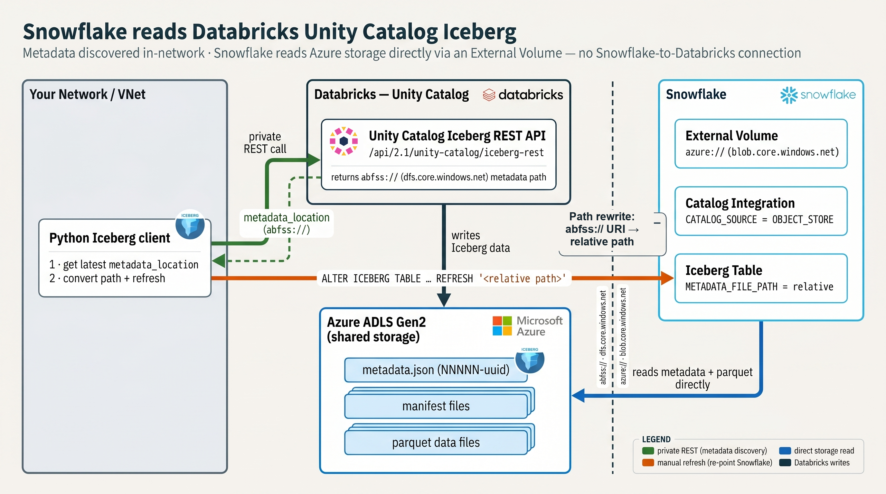

# Snowflake-Databricks Iceberg Integration

Enable Snowflake to read Apache Iceberg tables from Databricks Unity Catalog using PyIceberg for metadata discovery.



## Why This Approach?

In enterprise environments, Snowflake often cannot directly reach Databricks Unity Catalog over private networks. This package solves that by:

1. **PyIceberg** (runs in your network) connects to Databricks UC Iceberg REST API
2. **Discovers** the latest `metadata.json` paths for each table
3. **Snowflake** reads tables via External Volume + `OBJECT_STORE` Catalog Integration

This keeps all network traffic within your control:
- PyIceberg → Databricks: Your private network / VNet
- Snowflake → Azure Storage: Azure Private Link capable

```
┌─────────────────┐                              ┌─────────────────────┐
│  Your Network   │      Private Network         │    DATABRICKS       │
│                 │ ───────────────────────────► │    Unity Catalog    │
│  ┌───────────┐  │                              │    Iceberg REST API │
│  │ PyIceberg │  │  GET metadata.json paths     │                     │
│  │ Client    │  │ ◄─────────────────────────── │  /api/2.1/unity-    │
│  └─────┬─────┘  │                              │  catalog/iceberg-   │
│        │        │                              │  rest               │
└────────┼────────┘                              └─────────────────────┘
         │
         │ Update Snowflake tables
         │ with metadata paths
         ▼
┌─────────────────┐                              ┌─────────────────────┐
│   SNOWFLAKE     │      Azure Private Link      │  AZURE STORAGE      │
│                 │ ───────────────────────────► │  (ADLS Gen2)        │
│  CATALOG_SOURCE │                              │                     │
│  = OBJECT_STORE │  Read Iceberg data files     │  metadata.json      │
│                 │ ◄─────────────────────────── │  *.parquet          │
│  External Volume│                              │                     │
└─────────────────┘                              └─────────────────────┘
```

## Why a path rewrite and manual refresh are needed

This package has Snowflake read Databricks's Iceberg tables through a Snowflake **External
Volume** with an **`OBJECT_STORE`** catalog integration. Two properties of that method drive
everything the package does.

### 1. The path Databricks reports must be rewritten

Databricks records a table's current metadata pointer as an **absolute `abfss://` URI** — the
ADLS Gen2 / ABFS form, with the container in the authority and the `dfs.core.windows.net` host.
The Unity Catalog Iceberg REST API returns, for example:

```
abfss://container@account.dfs.core.windows.net/root/__unitystorage/.../metadata/00007-uuid.metadata.json
```

Snowflake addresses the same storage through its own **`azure://`** scheme (not `abfss://`),
and `METADATA_FILE_PATH` is a path **relative to the external volume's `STORAGE_BASE_URL`** —
not an absolute URI. So the package strips the scheme, container, account host, and the shared
`root/` prefix to produce the relative path Snowflake expects:

```
abfss://container@account.dfs.core.windows.net/root/__unitystorage/.../00007-uuid.metadata.json
                                                    └────────────────────────┬────────────────────────┘
                                                                             ▼
                            METADATA_FILE_PATH = '__unitystorage/.../00007-uuid.metadata.json'
```

(See `TableRefresher.convert_abfss_to_snowflake_path()`.)

> **The endpoint is *not* the obstacle — the URI shape is.** Snowflake accepts *both* Azure
> storage endpoints in `STORAGE_BASE_URL`, as long as you use the `azure://` prefix:
> `azure://<account>.blob.core.windows.net/<container>/` **or**
> `azure://<account>.dfs.core.windows.net/<container>/`
> ([Snowflake docs](https://docs.snowflake.com/en/user-guide/tables-iceberg-configure-external-volume-azure)).
> Point the external volume at the **same `dfs` endpoint Databricks uses** and the byte paths
> line up exactly — but you still convert the *absolute* `abfss://` URI into a *relative*
> `METADATA_FILE_PATH`, and (see below) you still refresh manually.

### 2. `OBJECT_STORE` pins a literal path and never auto-refreshes

Because the value Snowflake stores is a **literal, relative metadata-file path** — not a live
catalog reference — Snowflake has no way to discover that Databricks has written a newer
`metadata.json`. Every Databricks commit (INSERT / MERGE / OPTIMIZE / schema change) produces
a new `NNNNN-uuid.metadata.json`; until you re-point Snowflake at it, queries return stale data.
Closing that gap is the entire job of this package:

1. Ask Databricks (via PyIceberg) for the **current** `metadata_location`.
2. Convert the absolute `abfss://` URI into the relative `METADATA_FILE_PATH`.
3. `ALTER ICEBERG TABLE … REFRESH '<relative-path>'` (or `CREATE` on first run).

> **What about auto-refresh via the Iceberg REST catalog?** Snowflake can auto-sync with Unity
> Catalog using a [**catalog-linked database**](https://docs.snowflake.com/en/user-guide/tables-iceberg-catalog-linked-database)
> (`CATALOG_SOURCE = ICEBERG_REST`): it detects new tables and snapshots automatically and removes
> the need for manual refresh entirely. **Prefer it when Snowflake can reach the Databricks workspace
> over public networking.**
>
> The catch is the **network path**: that auto-sync requires *Snowflake itself* to call the Azure
> Databricks REST endpoint, and **reaching Azure Databricks from Snowflake over Azure Private Link is
> not a generally-available configuration** — it depends on a Snowflake-side private-connectivity
> capability that isn't broadly enabled. So in a locked-down / Private Link environment the REST path
> normally has to traverse **public** networking to Databricks, which is often a non-starter. (Even the
> Entra-service-principal auth variant is [documented as public-networking only](https://learn.microsoft.com/azure/databricks/external-access/iceberg).)
>
> The `OBJECT_STORE` method here sidesteps that entirely: **Snowflake only ever connects to your Azure
> storage, never to Databricks** — and storage Private Link is GA — while the in-network client reaches
> Databricks privately. That makes manual refresh the pragmatic choice for Private Link / locked-down
> deployments, not just a fallback. See [docs/ARCHITECTURE.md](docs/ARCHITECTURE.md#why-not-iceberg_rest).

## Quick Start

### Installation

```bash
# Using uv (recommended)
uv pip install -e .

# Using pip
pip install -e .
```

### Environment Variables

```bash
# .env file
DATABRICKS_HOST=https://adb-123456789.10.azuredatabricks.net
DATABRICKS_TOKEN=dapi...  # Or use Azure CLI auth

SNOWFLAKE_ACCOUNT=ORGNAME-ACCOUNTNAME
SNOWFLAKE_USER=your_user
SNOWFLAKE_PASSWORD=your_password
SNOWFLAKE_WAREHOUSE=COMPUTE_WH

AZURE_TENANT_ID=your-tenant-id  # Optional, auto-detected from Azure CLI
```

## Databricks-side prerequisites

Before this package can read anything, the Databricks side must be set up. These are **one-time**
steps for a workspace/metastore admin (and the catalog owner). They are easy to miss — skipping
them is the most common cause of `load_table()` permission failures.

### 1. Enable external Iceberg access on the metastore

External engines can only reach Unity Catalog's Iceberg REST API if the metastore allows it.
In the **account console → metastore settings**, enable **External data access**.
([Docs](https://learn.microsoft.com/azure/databricks/external-access/iceberg#requirements).)

### 2. Grant the principal `EXTERNAL USE SCHEMA`

The principal the client authenticates as (PAT user, or the Entra / Databricks service principal)
needs read access **plus** `EXTERNAL USE SCHEMA` on the schema — that privilege is what authorises
Iceberg-REST metadata access for external engines:

```sql
GRANT USE CATALOG         ON CATALOG <catalog>          TO `<principal>`;
GRANT USE SCHEMA          ON SCHEMA  <catalog>.<schema> TO `<principal>`;
GRANT SELECT              ON SCHEMA  <catalog>.<schema> TO `<principal>`;
GRANT EXTERNAL USE SCHEMA ON SCHEMA  <catalog>.<schema> TO `<principal>`;  -- required for external Iceberg reads
```

Only the catalog owner (or a metastore admin) can grant `EXTERNAL USE SCHEMA`.

### 3. Make the tables readable as Iceberg

The Iceberg REST catalog exposes these Databricks table types:

| Databricks table | Readable as Iceberg? | How |
|------------------|----------------------|-----|
| Managed Iceberg (native) | ✅ | nothing extra |
| Managed / External Delta | ✅ | enable **UniForm** |
| Foreign Iceberg | ✅ | `REFRESH FOREIGN TABLE` to update |

For **Delta** tables, enable UniForm so Databricks also writes Iceberg metadata on every commit:

```sql
ALTER TABLE <catalog>.<schema>.<table> SET TBLPROPERTIES (
  'delta.enableIcebergCompatV2'          = 'true',
  'delta.universalFormat.enabledFormats' = 'iceberg'
);
```

([Docs: Read Delta tables with Iceberg clients](https://learn.microsoft.com/azure/databricks/delta/uniform).)

### 4. Pick the right catalog

> **Gotcha:** in the PyIceberg / catalog config, `warehouse` is the **Unity Catalog catalog name**
> — *not* a Databricks SQL warehouse or compute. This package's `--catalog` argument sets it.

```yaml
catalog:
  unity_catalog:
    uri: https://<workspace-url>/api/2.1/unity-catalog/iceberg-rest
    warehouse: <uc-catalog-name>   # ← the UC catalog, NOT a SQL warehouse
    token: <pat-or-oauth-token>
```

One client instance addresses one catalog; configure separately for each catalog you need.

## Usage

### Step 1: Create External Volume in Snowflake

The External Volume provides Snowflake access to Azure Storage where your Iceberg data lives.

```bash
python -m snowflake_databricks_iceberg.external_volume \
  --volume-name databricks_iceberg_volume \
  --storage-base-path root/
```

This will:
1. Create the External Volume
2. Open Azure consent URL (grant admin consent)
3. Assign Storage Blob Data Contributor role to Snowflake's service principal
4. Create the required `OBJECT_STORE` Catalog Integration

### Step 2: Refresh Tables Using PyIceberg

PyIceberg connects to Databricks UC to get the latest metadata paths, then creates/refreshes Snowflake tables.

```bash
python -m snowflake_databricks_iceberg.table_refresher \
  --catalog main \
  --schema my_iceberg_schema \
  --snowflake-db MY_DATABASE \
  --snowflake-schema MY_SCHEMA \
  --external-volume databricks_iceberg_volume
```

This will:
1. Connect to Databricks via PyIceberg REST client
2. List all tables in the schema
3. Get `metadata.json` location for each table
4. Create or refresh Snowflake Iceberg tables

### Step 3: Query in Snowflake

```sql
-- Tables are now queryable
SELECT * FROM MY_DATABASE.MY_SCHEMA.my_table LIMIT 10;

-- Check table metadata
DESC ICEBERG TABLE my_table;
```

## Python API

### PyIceberg Catalog Client

```python
from snowflake_databricks_iceberg import IcebergCatalogClient

# Connect to Unity Catalog
client = IcebergCatalogClient(
    workspace_host="https://adb-xxx.azuredatabricks.net",
    catalog_name="main"
)

# List tables
tables = client.list_tables("my_schema")

# Get metadata location (for Snowflake refresh)
for table_name in tables:
    metadata_path = client.get_metadata_location("my_schema", table_name)
    print(f"{table_name}: {metadata_path}")
```

### Catalog Integration

```python
from snowflake_databricks_iceberg import CatalogIntegration

# Create OBJECT_STORE catalog integration (REQUIRED for Iceberg)
integration = CatalogIntegration()
integration.create_object_store("my_volume_catalog")
```

### Table Refresher

```python
from snowflake_databricks_iceberg import TableRefresher

refresher = TableRefresher(
    databricks_catalog="main",
    databricks_schema="my_schema",
    snowflake_db="MY_DB",
    snowflake_schema="MY_SCHEMA",
    external_volume="my_volume"
)

# Refresh all tables
results = refresher.refresh_all()

# Or refresh a single table
refresher.refresh_table("my_table", "path/to/metadata.json")
```

## Snowflake Components

### Catalog Integration (Required) — a *local* OBJECT_STORE integration

Snowflake requires a Catalog Integration for **every** Iceberg table. With this method you
create a **local** integration — `CATALOG_SOURCE = OBJECT_STORE` — which tells Snowflake that
*it* owns the table's metadata pointer (the `METADATA_FILE_PATH` you supply), rather than a
*remote* `ICEBERG_REST` integration that would delegate metadata to Databricks Unity Catalog.

Create **one per external volume**, conventionally named `{external_volume}_catalog`:

```sql
CREATE CATALOG INTEGRATION databricks_iceberg_volume_catalog
  CATALOG_SOURCE = OBJECT_STORE   -- "local": Snowflake tracks metadata, you refresh it
  TABLE_FORMAT   = ICEBERG
  ENABLED        = TRUE;
```

You don't normally write this by hand — the package creates it for you and is idempotent
(it runs `SHOW CATALOG INTEGRATIONS` first and skips if the name already exists):

```python
from snowflake_databricks_iceberg import CatalogIntegration

CatalogIntegration().create_object_store("databricks_iceberg_volume_catalog")
```

`TableRefresher` also ensures this integration exists before it creates or refreshes any
table, so a fresh run bootstraps the local catalog automatically. Every Iceberg table then
references it by name via `CATALOG = '<external_volume>_catalog'` (see below).

> **Local vs. remote, in one line:** `OBJECT_STORE` = local catalog, manual `REFRESH`, you
> control the path (this package). `ICEBERG_REST` = remote catalog, `AUTO_REFRESH`, Snowflake
> calls Databricks directly — see [why a path rewrite and manual refresh are needed](#why-a-path-rewrite-and-manual-refresh-are-needed) for why that's avoided here.

### External Volume

```sql
-- Created by the external_volume module.
-- Use the dfs (ADLS Gen2) endpoint — Databricks UC storage is HNS/Gen2, and Snowflake
-- requires a dfs.core.windows.net STORAGE_BASE_URL for Gen2 interop. (blob also works
-- via --endpoint blob, but dfs is the default and the recommended endpoint here.)
CREATE EXTERNAL VOLUME databricks_iceberg_volume
  STORAGE_LOCATIONS = (
    (
      NAME = 'azure_storage'
      STORAGE_PROVIDER = 'AZURE'
      STORAGE_BASE_URL = 'azure://account.dfs.core.windows.net/container/root/'
      AZURE_TENANT_ID = 'your-tenant-id'
    )
  );
```

### Iceberg Tables

```sql
-- Tables are created/refreshed by the table_refresher module
CREATE ICEBERG TABLE my_table
  EXTERNAL_VOLUME = 'databricks_iceberg_volume'
  CATALOG = 'databricks_iceberg_volume_catalog'
  METADATA_FILE_PATH = '__unitystorage/.../metadata/00001-xxx.metadata.json';

-- Manual refresh when data changes
ALTER ICEBERG TABLE my_table REFRESH 'path/to/new-metadata.json';
```

### Granting access (RBAC): Iceberg tables need their *own* grants

This is the single most common Snowflake-side gotcha. **Snowflake treats Iceberg tables as a
distinct object class from standard tables.** A bulk grant on `TABLES` does **not** cascade to
Iceberg tables — so the usual pattern silently grants a role *nothing* on the tables created by
this package:

```sql
-- ❌ WRONG — does NOT cover Iceberg tables. The role can connect but every SELECT fails.
GRANT SELECT ON ALL    TABLES IN SCHEMA my_db.my_schema TO ROLE analyst;
GRANT SELECT ON FUTURE TABLES IN SCHEMA my_db.my_schema TO ROLE analyst;
```

You must grant on the **`ICEBERG TABLES`** object class explicitly:

```sql
-- ✅ CORRECT — Iceberg tables are their own object class
GRANT SELECT ON ALL    ICEBERG TABLES IN SCHEMA my_db.my_schema TO ROLE analyst;
GRANT SELECT ON FUTURE ICEBERG TABLES IN SCHEMA my_db.my_schema TO ROLE analyst;
```

Notes:

- `ALL` covers tables that exist **right now**; `FUTURE` covers tables created **later** (this
  package creates a new Iceberg table the first time it sees one in Databricks, so you want
  `FUTURE` too — otherwise newly-registered tables are unreadable until you re-grant).
- The same split applies at database scope (`… IN DATABASE my_db …`) and to single tables
  (`GRANT SELECT ON ICEBERG TABLE my_db.my_schema.my_table …`).
- The role also needs `USAGE` up the hierarchy: `GRANT USAGE ON DATABASE …` and
  `GRANT USAGE ON ALL/FUTURE SCHEMAS IN DATABASE …` before any table grant resolves.
- This is **Snowflake-side** RBAC (who may query the registered tables). It is separate from
  the **Databricks-side** grants the PyIceberg client needs to *read metadata*
  (`USE CATALOG`, `USE SCHEMA`, `SELECT`, and `EXTERNAL USE SCHEMA` on the source schema).

```sql
-- Minimal working grant set for a read-only Snowflake role
GRANT USAGE  ON DATABASE my_db                              TO ROLE analyst;
GRANT USAGE  ON ALL    SCHEMAS IN DATABASE my_db            TO ROLE analyst;
GRANT USAGE  ON FUTURE SCHEMAS IN DATABASE my_db            TO ROLE analyst;
GRANT SELECT ON ALL    ICEBERG TABLES IN DATABASE my_db     TO ROLE analyst;
GRANT SELECT ON FUTURE ICEBERG TABLES IN DATABASE my_db     TO ROLE analyst;
```

## Automating Refresh

Since this is a manual refresh approach, you'll want to automate it. Options:

### 1. Scheduled Job (Databricks Workflow)

```python
# Run as a Databricks job on schedule
from snowflake_databricks_iceberg import TableRefresher

refresher = TableRefresher(...)
refresher.refresh_all()
```

### 2. Airflow DAG

```python
from airflow.operators.python import PythonOperator

def refresh_snowflake_tables():
    from snowflake_databricks_iceberg import TableRefresher
    refresher = TableRefresher(...)
    refresher.refresh_all()

refresh_task = PythonOperator(
    task_id='refresh_snowflake_iceberg',
    python_callable=refresh_snowflake_tables,
)
```

### 3. Delta Live Tables Post-Hook

After your DLT pipeline completes, trigger a refresh.

## Architecture Details

See [docs/ARCHITECTURE.md](docs/ARCHITECTURE.md) for detailed diagrams.

### Key Points

1. **PyIceberg REST Endpoint**: `{workspace}/api/2.1/unity-catalog/iceberg-rest` (note the hyphen)
2. **Catalog Integration**: `CATALOG_SOURCE = OBJECT_STORE` is required for External Volume method
3. **Metadata Path**: Relative to External Volume's `STORAGE_BASE_URL`
4. **UniForm Tables**: Metadata is under `__unitystorage/.../<table_id>/metadata/`

## Terraform

Optional Terraform modules are provided in `terraform/` for:
- Snowflake Storage Integration
- Azure RBAC assignments
- Service Principal lookup

## Requirements

- Python 3.10+
- Databricks workspace with Unity Catalog
- Snowflake account (ACCOUNTADMIN for creating integrations)
- Azure Storage Account (ADLS Gen2)

## License

Apache License 2.0
